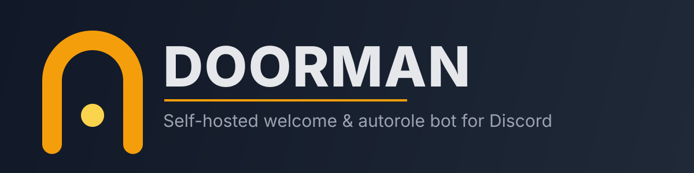

<p align="center">
  
</p>

<p align="center">
  
  
  
  
  
</p>

<p align="center">
  
  
  
</p>

<p align="center"><i>A self-hosted Discord bot that greets new members: assigns a role on
join, posts a custom welcome card, and can route a different role depending on the
invite link someone used. Built after ProBot — the hosted bot most servers relied on
for this — went down.</i></p>

---

## What it does

- **Autorole on join** — assign one or more roles automatically when someone joins.
- **Welcome card** — the new member's avatar and username are composited onto a
  banner image you upload per server, then posted to a welcome channel.
- **Role by invite link** — map specific invite codes to specific roles (e.g. a
  partner's invite grants a "Partner" role automatically).
- **Anti-raid guard** — accounts younger than a configurable age are held in a
  pending-approval queue instead of being auto-roled, so a burst of freshly created
  accounts doesn't walk straight into your server's roles.
- **Web dashboard** — switch between every server you manage, configure all of the
  above, and approve/deny pending joins, all from a browser.

You run your own copy, with your own bot token. There's no hosted service, no
account to create with a third party, and your server's data (members, invites,
uploaded banners) never leaves your own database.

## Architecture

<div align="center">

```text
Discord Gateway ─┐
                  ├─> apps/bot (discord.js) ─┐
Discord REST ─────┘                          ├─> PostgreSQL (packages/database)
                                              │
Browser (OAuth login) ─> apps/web (Next.js) ─┘
```

</div>

A single pnpm monorepo, one Docker image run as two processes (`bot`, `web`) plus
Postgres — see [`compose.yaml`](compose.yaml).

## Quick start

```bash
git clone https://github.com/PrimeBuild-pc/Doorman.git
cd Doorman
./install.sh
```

The installer walks you through the one thing it can't do for you — creating the
Discord application — then writes `.env` and starts everything with Docker Compose.

### Discord app setup (manual, ~5 minutes)

1. [Discord Developer Portal](https://discord.com/developers/applications) → **New
   Application**.
2. **Bot** tab → enable the **Server Members Intent** toggle (required to receive
   join events) → **Reset Token** and copy it.
3. **OAuth2** tab → copy the **Client Secret** → under **Redirects**, add
   `<your PUBLIC_URL>/api/auth/callback`.
4. **OAuth2 → URL Generator** → scope `bot`; bot permissions: **View Channels,
   Send Messages, Attach Files, Manage Roles, Manage Guild**. Use the generated
   URL to invite the bot to your server.
5. Run `./install.sh` and paste the Application ID, Client Secret, and Bot Token
   when asked.
6. Open the dashboard at your `PUBLIC_URL`, log in with Discord, pick your server,
   set a default role, upload a banner, and you're done.

## Development

```bash
pnpm install
pnpm build       # compiles packages/shared and packages/database first — apps/bot
                 # and apps/web resolve both from their built dist/ output
pnpm --filter @doorman/database exec prisma db push   # needs DATABASE_URL set
pnpm dev:bot     # apps/bot with hot reload
pnpm dev:web     # apps/web (Next.js dev server)
pnpm typecheck && pnpm lint && pnpm test
```

## Notes and limits

- Uploaded banners are stored on a local Docker volume, not a third-party bucket —
  back up the `uploads` volume yourself if that matters to you.
- The anti-raid guard is a simple account-age gate, not a full anti-raid suite —
  it catches the common "mass-created alt accounts" pattern, not a coordinated
  raid using older accounts.
- One bot, one server family: like [D-View](https://github.com/PrimeBuild-pc/D-View),
  this is meant to be self-hosted per Discord community, not run as a public
  multi-tenant service.

## License

MIT — see [LICENSE](LICENSE).
